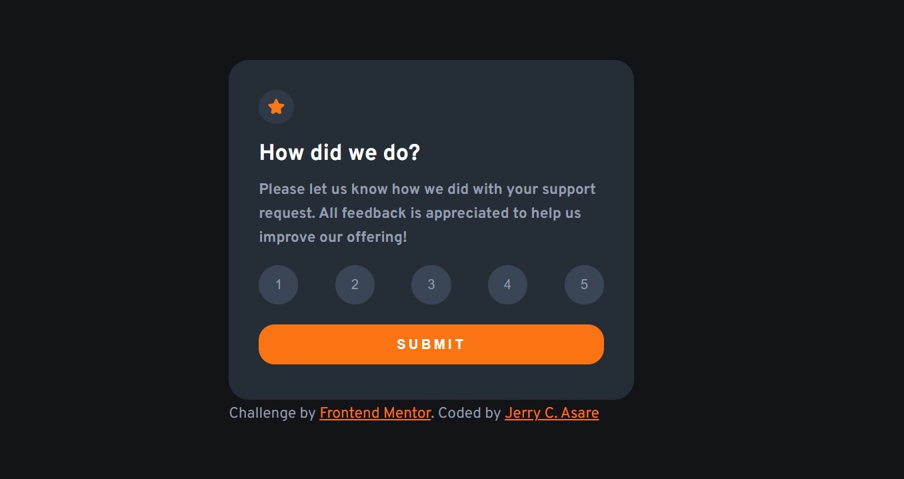
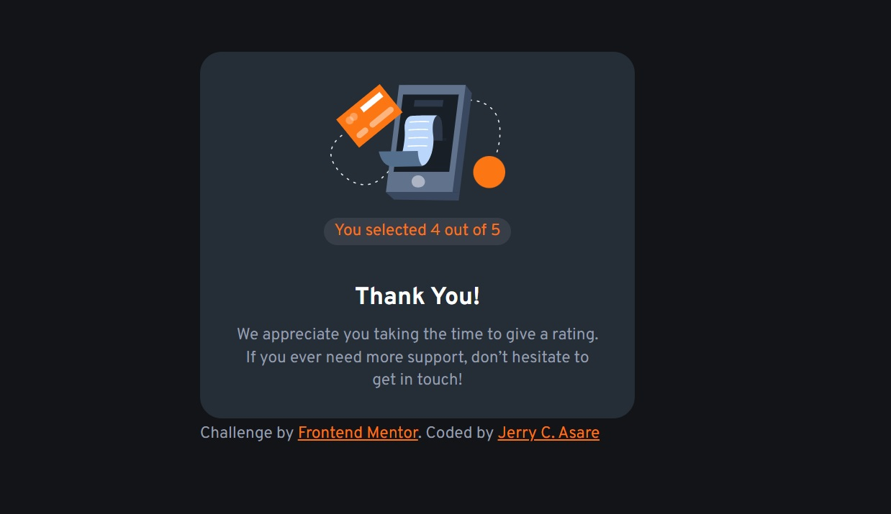
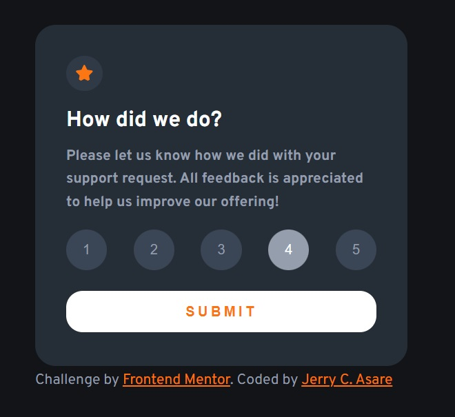
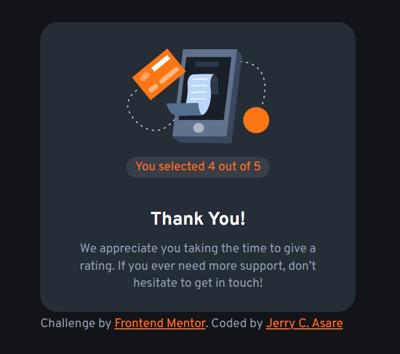

# Frontend Mentor - Interactive rating component solution

This is a solution to the [Interactive rating component challenge on Frontend Mentor](https://www.frontendmentor.io/challenges/interactive-rating-component-koxpeBUmI). Frontend Mentor challenges help you improve your coding skills by building realistic projects.

## Table of contents

- [Overview](#overview)
  - [The challenge](#the-challenge)
  - [Screenshot](#screenshot)
  - [Links](#links)
- [My process](#my-process)
  - [Built with](#built-with)
  - [What I learned](#what-i-learned)
  - [Continued development](#continued-development)
- [Author](#author)
- [Acknowledgments](#acknowledgments)

**Note: Delete this note and update the table of contents based on what sections you keep.**

## Overview

### The challenge

Users should be able to:

- View the optimal layout for the app depending on their device's screen size
- See hover states for all interactive elements on the page
- Select and submit a number rating
- See the "Thank you" card state after submitting a rating

### Screenshot








### Links

- Solution URL: [https://github.com/jcasare/FrontEndChallenges-interactive-rating-component]
- Live Site URL: [https://jcasare.github.io/FrontEndChallenges-interactive-rating-component/]

## My process

### Built with

- Semantic HTML5 markup
- CSS custom properties
- Flexbox
- JavaScript
- Mobile-first workflow
- DOM


### What I learned

I learnt how to use JavaScript and DOM to select and make changes to elements. I also used the 'focus' css pseudo element for the first time which saved my hours of struggle on changing the background color after a button was selected. Finally, I used the 'addEventListener' procedure to listen to button clicks.

To see how you can add code snippets, see below:

```css
.proud-of-this-css:focus {
    color:white;
    background-color:hsl(217, 12%, 63%);
}
```


### Continued development

I want to focus on mastering JavaScript more because I've got a lot to learn.


## Author

- GitHub - [Jerry C. Asare](https://www.github.com/jcasare)
- Frontend Mentor - [@jcasare](https://www.frontendmentor.io/profile/jcasare)
- Twitter - [@vhybesofficial](https://www.twitter.com/vhybesofficial)
- LinkedIn = [Jerry Comforter Asare](https://www.linkedin.com/in/jerry-asare-comforter-8b164b192/)


## Acknowledgments
I'd like to thank Angela Yu for her wonderful training....and also to Frontend Mentor for these challenges.
